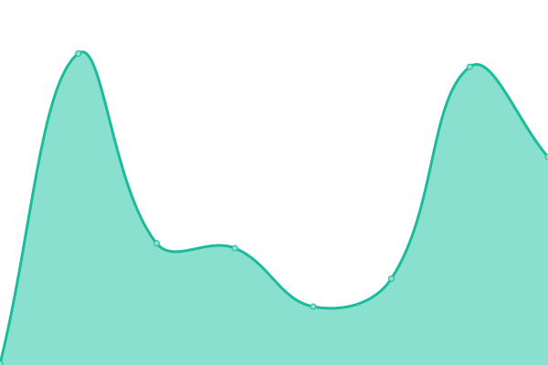

# [📈 Live Status](https://status.syfr.app): <!--live status--> **🟧 Partial outage**

<!--start: status pages-->
<!-- This summary is generated by Upptime (https://github.com/upptime/upptime) -->
<!-- Do not edit this manually, your changes will be overwritten -->
<!-- prettier-ignore -->
| URL | Status | History | Response Time | Uptime |
| --- | ------ | ------- | ------------- | ------ |
|  [Syfr](https://syfr.app) | 🟢 Up | [syfr.yml](https://github.com/syfrtech/status/commits/HEAD/history/syfr.yml) | 

 610ms
     
 | 

<a href="https://status.syfr.app/history/syfr">100.00%</a>
    

|  [Syfr Dev Playground](https://develop-api.syfr.app/playground) | 🟥 Down | [syfr-dev-playground.yml](https://github.com/syfrtech/status/commits/HEAD/history/syfr-dev-playground.yml) | 

 0ms
     
 | 

<a href="https://status.syfr.app/history/syfr-dev-playground">100.00%</a>
    

<!--end: status pages-->

[**Visit our status website →**](https://status.syfr.app)
